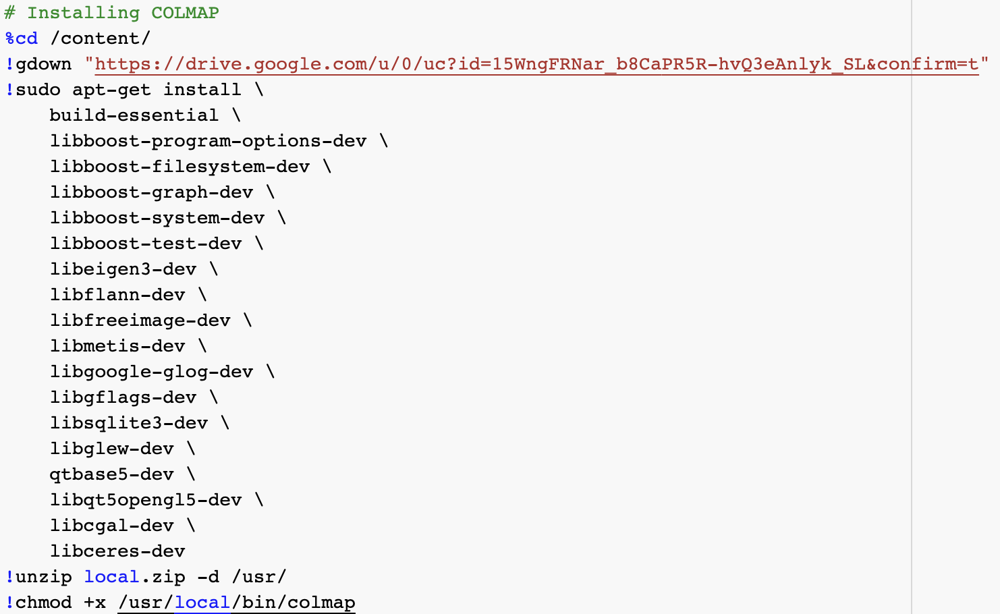
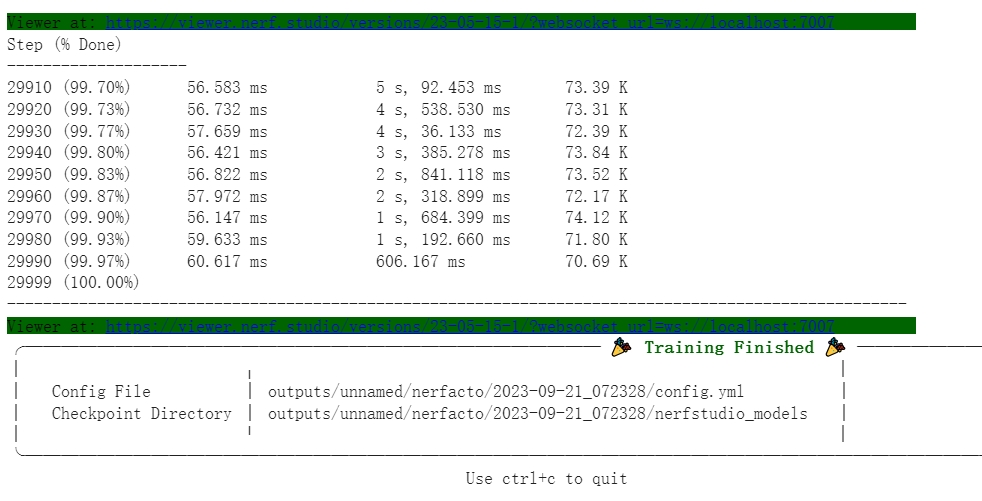

## Neural radiance field (NeRF) 的构建

实验平台：[nerfstudio](https://github.com/nerfstudio-project/nerfstudio), [google colab](https://colab.research.google.com/github/nerfstudio-project/nerfstudio/blob/main/colab/demo.ipynb)

### 实验步骤

#### 1. 选择想构建的3D物体，以其为中心，使用摄像头围绕物体拍摄尽可能多视角的视频，注意保持摄像机位的稳定性和平滑性。

#### 2. 打开nerfstudio官方部署的colab代码，执行Install Nerfstudio and Dependencies.

这一步官方给出的代码无法顺利安装colmap，因此在后续处理自定义视频时会出现如下bug：

<font color=Red>`Could not find COLMAP. Please install COLMAP`</font>

这里的COLMAP是采样视频帧为图像，并计算出每张图片相对于拍摄主体的相机位姿。这个bug产生的原因是由于官方存储在google drive的colmap镜像无法连接。

**(解决方式一，推荐)**需要替换Install Nerfstudio and Dependencies中的colmap安装指令:

将：

替换为：

```shell
# install colmap
!sudo apt-get install \
    git \
    cmake \
    ninja-build \
    build-essential \
    libboost-program-options-dev \
    libboost-filesystem-dev \
    libboost-graph-dev \
    libboost-system-dev \
    libeigen3-dev \
    libflann-dev \
    libfreeimage-dev \
    libmetis-dev \
    libgoogle-glog-dev \
    libgtest-dev \
    libsqlite3-dev \
    libglew-dev \
    qtbase5-dev \
    libqt5opengl5-dev \
    libcgal-dev \
    libceres-dev
%cd /content/
!git clone https://github.com/colmap/colmap.git
%cd colmap
!git checkout dev
!mkdir build
%cd build
!cmake .. -GNinja
!ninja
!sudo ninja install
```

替换并运行安装程序后，会产生一个报错：


出错的原因是编译程序检测到系统有cuda可用，但是我们没有给它设置cuda类型。我们打开colmap根目录下的CMakeLists.txt，在43行添加字段：`set(CMAKE_CUDA_ARCHITECTURES "native")`，之后重新运行安装程序即可完成安装（安装预计会花费较长时间，请耐心等待）。

#### 解决方式二因为需要CUDA和Visual Studio等依赖条件，所以安装COLMAP可能因为依赖项的原因出现报错，所以较为推荐解决方式一。

> **(解决方式二)**我们自行在计算机上安装COLMAP，不同的系统需要在命令行中使用不同的安装指令，如若出现安装bug请自行查阅[colmap](https://colmap.github.io/install.html)：
>
> #### Windows
>
> *Recommended dependencies:* CUDA (at least version 7.X), Visual Studio 2019
>
> ```shell
> git clone https://github.com/microsoft/vcpkg
> cd vcpkg
> .\bootstrap-vcpkg.bat
> .\vcpkg install colmap[cuda,tests]:x64-windows
> ```
>
> #### MAC OS
>
> ```shell
> brew install \
>     git \
>     cmake \
>     boost \
>     eigen \
>     freeimage \
>     flann \
>     glog \
>     googletest \
>     metis \
>     suite-sparse \
>     ceres-solver \
>     qt5 \
>     glew \
>     cgal \
>     sqlite3
> 
> ```
>
> ```shell
> git clone https://github.com/colmap/colmap.git
> cd colmap
> git checkout dev
> mkdir build
> cd build
> cmake .. -DQt5_DIR=/opt/homebrew/opt/qt@5/lib/cmake/Qt5
> make
> sudo make install
> ```
>
> #### Linux
>
> ```shell
> sudo apt-get install \
>     git \
>     cmake \
>     ninja-build \
>     build-essential \
>     libboost-program-options-dev \
>     libboost-filesystem-dev \
>     libboost-graph-dev \
>     libboost-system-dev \
>     libeigen3-dev \
>     libflann-dev \
>     libfreeimage-dev \
>     libmetis-dev \
>     libgoogle-glog-dev \
>     libgtest-dev \
>     libsqlite3-dev \
>     libglew-dev \
>     qtbase5-dev \
>     libqt5opengl5-dev \
>     libcgal-dev \
>     libceres-dev
> ```
>
> ```shell
> git clone https://github.com/colmap/colmap.git
> cd colmap
> git checkout dev
> mkdir build
> cd build
> cmake .. -GNinja
> ninja
> sudo ninja install
> ```
>
> COLMAP成功安装之后，在python运行环境下运行所提供的colmap2nerf.py文件，如在命令行中运行（也可直接运行.py文件）:
>
> ```shell
> python ./colmap2nerf.py --video_in <your_video_path>.mp4 --video_fps 2 --run_colmap --aabb_scale 32
> ```
>
> 之后会获得由视频采样获得的一组**图片集**和存储每张图片对应的相机位姿的**json文件**:
>
> <!--注意检查transform.json文件中每张图片的映射地址是否正确-->
>
> #### 需要将训练数据集上传到colab项目文件夹中
>
> content
>
> - data
>   - nerfstudio
>     - custom_data
>       - transform.json
>
>       - images
>
>         - 001.jpg
>         - 002.jpg
>         - ……
>

#### 3. 处理视频

在Downloading and Processing Data中，选择upload your own video，这一步通常要耗费大量时间（约2h），请等待至data/nerfstudio/custom_data文件夹下产生transform.json文件，此时也标志着“Downloading and Processing Data"部分全部结束。


#### 4. 训练

在nerfstudio的代码中执行之后的步骤，包括”Set up and Start Viewer“和”Start Training“，渲染过程持续较久，取决于具体场景，等到出现下图即标志训练结束（注意，如果使用解决方法二上传处理后的图片，需要删除Start Training中的` --downscale-factor 4`字段。）



#### 5. 录制或导出成果视频

可自行选择使用录屏软件展示训练好的NeRF实例或者使用Nerfstudio Viewer导出视频。

#### 6. 额外注意事项

使用colab时训练过程是在远程主机上进行，所以为了使得训练结果可以展示在本地主机上，需要在训练开始前从本地连接远端主机对应端口。

从命令行直接输入以下操作命令：
ssl -L 7007:<training-host-ip>:7007 <username>@<training-host-ip>，其中training-host-ip是远程主机的IP地址，username是colab的账号，一般是登录邮箱

获取远程主机的IP地址的代码如下：

 ```shell
import requests
import json

# 现在我们要获取自己IP
res = requests.get("https://searchplugin.csdn.net/api/v1/ip/get?")
res = res.text
res = json.loads(res)
data = res.get("data")

address = data.get("address")
ip = data.get("ip")
print("您的位置是："+address+"，您的IP地址是："+ip)
> ```

将得到的IP地址和自己的账户邮箱套入模板输入命令行即可，注意不用保留<>, 如果出现"ssh: connect to host * port *: Connection timed out"不用担心，只要在刷新Viewer后可以看到渲染过程即可。

#### 训练完成及时保存效果视频，否则网页刷新或网络不稳定断开连接后，Viewer可能无法再显式渲染结果